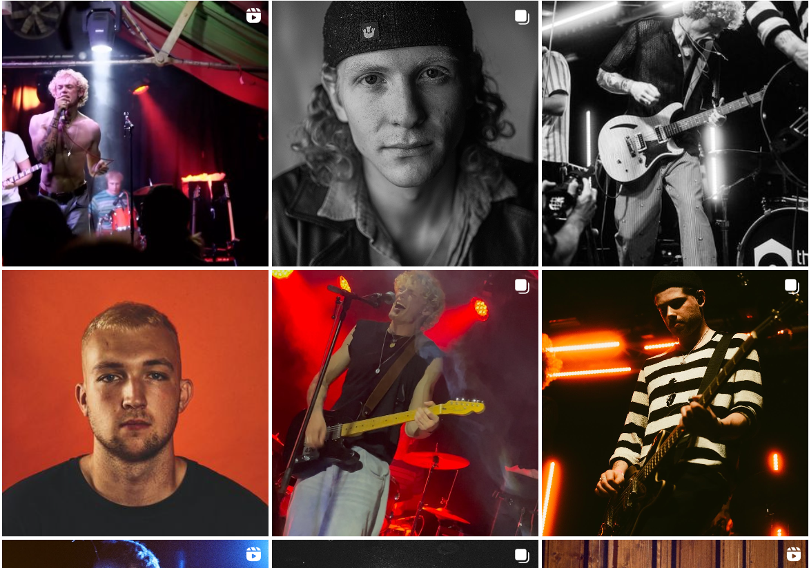

# JaVill Stage Rage

## Planning the project 

The idea for this project came from a meeting with a previous client. I have worked with this client across multiple projects, he always has fresh and out-of-the-box ideas. The client's current project is JaVill, a 5 piece band from Dublin. With loud fresh sounds and a bold colour palette, I was excited to work on anything to do with the band.

The pitch for the project was this - the client wanted some sort of interactive experience on the band website. The grapics would be simple portraits of the band members in an 8-bit art style. The player would be able to choose a band member to play as, and the game play would be extremely simple. We settled on an endless jumper game, an arcade classic and something I felt I could achieve as a novice developer. 

Some elements that were in the original plan were:
* A character selector that changes the skin of the selected character to one of the band members
* The character runs across a stage setting in front of a crowd
* The character can jump over amplifiers and can duck underneath mounted microphones
* A database for people to compare high scores over time

Not all these elements made it in to the final build, but they are being considered as future features.

## The Golden Age of Browser Games

As someone who grew up with Internet access, playing games online has always interested me. The Internet served as the perfect place for people to post home-grown simple software. During the 2000s, Adobe Flash allowed amateur developers to create their own games and post them to forums such as Newgrounds or Miniclip, along with larger MMOs offering games to their users, such as Neopets and Club Penguin.

These games are characterised by simple graphics, often rude humour and simple game play. The crude graphics give a lovingly home-made and authentic charm to to online games. Without the oversight of large corporations, these unsanitized and uncensored games gave player access to gaming experiences unlike anything being offered by big game companies at the time. This era also led to the massive success of "indie" game titles we see in pop culture today.

With the removal of browser support for Adobe Flash in 2021, many of these games became unplayable. This gives modern internet users a nostalgic feeling around these old, strange games that are no longer available to play. 

This project taps into that nostalgia with the use of hand-dran elements, pixel graphics and simple game play. However, unlike the Flash games of old, this project is not rendered obselete with the event of Flash's removal.

If you are interested, there is some further reading on this topic linked below: 
* [How Flash Games Shaped The Video Game Industry](https://www.flashgamehistory.com/#:~:text=It%20all%20started%20in%201996,automated%20Flash%20games%20website%2C%20Newgrounds.)
* [End of an Era: Flash Games](https://www.vancouverisawesome.com/events-and-entertainment/end-of-an-era-flash-games-3268327)
* [Wikipedia Entry: Browser Games](https://en.wikipedia.org/wiki/Browser_game)
* [How Flash Games Shaped Video Game History](https://www.gameinformer.com/2018/12/22/how-flash-games-changed-video-game-history)
* [What Happened to Flash?](https://www.lifewire.com/what-happened-to-flash-2617986#:~:text=What%20to%20Know,removed%20all%20Flash%2Drelated%20software.)

## The Web Page

JaVill do not currently have a website to host this browser game on. I built a simple one-page site to temporarily host this game. 

I leaned into the 2000s Internet aesthetic and kept the site very simple. After a sneak peek into JaVill's upcoming promotional photos, I chose some colours to match the theme and created a simple pixel gradient using the Bayer Matrix. Pixel gradients were first popularised in the clipart that was included in early Apple computers, and have a distinct feel to them, a mix of eccentric and Web 1.0. 

I kept the header simple, and decided to leave the plain blue hyperlink Web 1.0 aesthetic in the past. I designed a simple header with the game's title, with a childlish font that pays homage to the early days of browser based gaming. I made the text white so that it would stand out strongly against the dark background. The brush used for the title is a pixel brush on a small canvas, with the final image rendered out in 100% scale to minimise artifacting.

I added a plain black footer with some doodle-style representations of social media icons. In order to prompt the user to find the band on their socials, I also added a hand-written tag, asking the user to chack out the band's social media.

I also added a media query, so that when the screen width is small enough the footer gets bigger. The text also disappears and the social media icons are centered. This is in anticipation of making the page completely mobile friendly in the future.

## Styling the Game 

After a quick sketch on a napkin of the band members as caricatures, it was decided the game would be in an 8-bit style. This was inspired by the infinite runner/Frogger clone "Crossy Road", a game that was popular in the early days of mobile gaming. The game uses an 8-bit style in a 3D perspective.

I created some assets using a pixel art focused image editor, which I had previously used for pixel art for client work. I created a temporary character, while I wait for character design approval from the band members. 

I also created an amplifier and microphone sprite so the character has something to jump over and duck underneath.

~Background information~ 

## The Build

### HTML Canvas 

With the final half of my bachelor's degree focussed on Adobe Flash as an animation tool, I probably shouldn't have been so surprised when learning about the HTML canvas object for the first time. The possibilities with the canvas are truly infinite, and I have had a very fun time imagining the possibilities for this game. The canvas element is declared in HTML and populated using Javascript. 

The HTML canvas was even designed with 2D animation in mind. I learned about 2D context for the canvas [here](https://developer.mozilla.org/en-US/docs/Web/API/CanvasRenderingContext2D). From my research, the usual name for a variable to store context is ctx. 

The canvas also runs the clearRect method to wipe all old drawings off the canvas at each frame.

### Drawing on the Canvas

The drawImage() function can take up to nine variables. It can slice the image you want to draw, and draw a slice on each frame. Once I wrapped my head around the co-ordinate system, it was easy to manipulate images using the function. 

Within Unity, the sprite slice function works the same way. I have some experience with this, and it made things a little easier to place into the function and have it render out correctly.

I used the [W3 schools documentation](https://www.w3schools.com/graphics/tryit.asp?filename=trygame_default_gravity) to begin drawing images to the canvas. This can [also be used](https://developer.mozilla.org/en-US/docs/Web/API/HTMLCanvasElement/getContext) to set an alpha value, for example adding a background of crowd parallax in the future. The desynchronized method decouples the drawing of the canvas from the event loop, so a background could change at a different rate than a character for example.

For explaining the drawing of sprite to the canvas, [this page](https://spicyyoghurt.com/tutorials/html5-javascript-game-development/setup-html5-canvas-game) was also extremely useful and explained everything clearly.

Something I originally found hard to navigate was that the zero point of the x/y grid of the canvas is in the top left corner, as opposed to in the middle as I am used to working with.

### Animation

As with gameplay animation in the C# based Unity, the use of (+=) featured heavily in this project. 

For sprite slicing, I referenced [here](https://spicyyoghurt.com/tutorials/html5-javascript-game-development/images-and-sprite-animations).

Animation is a series of images over time. In order to create time in the game, I added an [interval loop](https://codeincomplete.com/articles/javascript-game-foundations-the-game-loop/).

I watched [this tutorial](https://www.youtube.com/watch?v=CY0HE277IBM&list=PLYElE_rzEw_uryBrrzu2E626MY4zoXvx2&ab_channel=Frankslaboratory) on more complex sprite animation access. This was so significant to my project that it in indicated in comments in the Javascript file. For the original simple animation loop I referenced [this](https://spicyyoghurt.com/tutorials/html5-javascript-game-development/images-and-sprite-animations) page. 

### Game Controllers

I looked at some ideas for player controls [here](https://www.w3schools.com/graphics/game_controllers.asp). I looked at the [Unity documentation](https://docs.unity3d.com/ScriptReference/KeyCode.DownArrow.html) to relate the Javascript project to a format I already was familiar with. I also learned more about [key handling events here](https://www.tutorialspoint.com/detecting-arrow-key-presses-in-javascript#:~:text=onkeydown%20JavaScript%20event%20handler%20by%20passing%20arrow%20key%20unique%20codes.&text=When%20the%20script%20executed%2C%20it,an%20alert%20%E2%80%9Cdown%20key%E2%80%9D) and looked at the [W3 schools page](https://www.w3schools.com/jsref/event_onkeypress.asp) on onkeypress event. I also looked into general [keyboard events](https://www.javascripttutorial.net/javascript-dom/javascript-keyboard-events/).

It's worth noting that the W3 schools tutorial on canvas games recommends the .keyCode method, but this is no longer suitable as it is deprecated. The more suitable method is .key.

I went through a few iterations of player controls, including a switch statement. Eventually I settled on event listeners from both keyup and keydown.

Eventually I would like to add WASD control. In my research, I also found out that the canvas can [support touch screen controls](https://www.w3schools.com/graphics/game_controllers.asp), so that would be something to look into as well in order to make the game playable on mobile.

### Physics

I never imagined I would actually use anything from Leaving Cert physics class after I left, but for this porject it came in handy. I originally thought of the character jump as having a maximum up, and having the player fall when the velocity reaches zero. 

While looking at how to implement gravity, I came across [this tutorial](https://medium.com/codex/making-the-easiest-javascript-game-b1a0b21794b4) describing how to build a game very similar to the one I wanted to make. While disheartened, I decided not to read the whole tutorial, as I was having fun figuring out the canvas functions from existing documentation.

I initally had some trouble working out the collision boxes. Eventually using some [logic](https://developer.mozilla.org/en-US/docs/Games/Tutorials/2D_Breakout_game_pure_JavaScript/Collision_detection) from this page, I implemented a system that uses the width and height of rendered objects to create a collision system.

I used the [IBM physic engine](https://developer.ibm.com/tutorials/wa-build2dphysicsengine/) page to help with the maths.

The player had an issue where they were landing under the canvas. On the completion of a jump, the player's Y position is set to the floor. 

There was also an infinite jump issue. The player can now only jump if they are standing on the floor.

### Obstacles

Rather than creating a new obstacle each time and destroying it once it leaves the canvas, the obstacles encountered by the players are simply drawn once and moved out of frame, then reset their x-position off-canvas to the right. This means the obstacles we see are actually the same two obstacles over and over again. I took the random interval geneator from [here](https://www.educative.io/answers/how-to-generate-a-random-number-between-a-range-in-javascript).

I also looked at the logic [on this page](https://www.w3schools.com/graphics/game_obstacles.asp) to get inspired on creating new obstacles.

I wanted the mic to spawn in at one-fifth the rate of the amp. I increased the random interval range that the mic is able to spawn in by 5. This means that, over a long enough time, the amp will spawn in at one-fifth the rate of the amp, as if has a chance of spawning five times further away. 

There is an issue with this spawning method. There is a chance that a mic and amp will spawn too close together, meaning the player will have to duck and jump at the same time. In the future, I could deal with this by drawing a larger collision box around the amp. On spawning, the mic object runs a check to see if it is within this larger collision box and if so, resets it's x position. This would prevent the objects from spawning too close together. For now, the player can deal with this "impossible" gameplay issue by cheating, as described below.

I also considered creating [new JS files for obstacle classes](https://bobbyhadz.com/blog/javascript-import-class-from-another-file) but ended up scrapping this idea as I wanted to keep the poroject simple for myself.

### Gameplay 

The lose condition is that if the player touches the amp they lose, and if they touch the mic without crouching they lose. The player must survive as long as possible. 

The original "sketch" of the logic was:

        if (distanceBetweenObjects === 0) {
            gameOver();
        }

        function distanceBetweenObjects(player, object) {
            if (playerArea is inside objArea) {
                return 0;
            }
        }

Instead of calculating custom bounding box, for mic collision check : 

        if ( mic collision true + down button held){
            continue game
        } else if {
            (mic collision true + !down button held){
                end game 
            }
        }

This worked better than creating extra collision logic for the mic, but it led to a small issue as described below in "Cheating". I got help with the collision logic [here](https://blog.thejaytray.com/canvas-basics-06-collision-detection/).

The speed of obstacles increases slowly over time. This is a simple way to increase the challenge of the game as time goes on. 

To reset the game, my process was this: 

On game over    * Game speed = 0 (to stop the game)
                * Game over printed to canvas 
                * Final score printed to canvas
                * Prompt player t0 play again 

To reset game, programme should 
                * Reset variables 
                * Remove UI related to game over

This was not too difficult to implement. The only issue was that when I changed the canvas size later in development, I had to change the reset variables as well.

### Bitmap Graphics

There are certain scaling issues to be considered when resizing the canvas and making it responsive. It is important to keep the [width and height at a constant ratio](https://www.w3schools.com/jsref/canvas_drawimage.asp#:~:text=The%20drawImage()%20method%20draws,increase%2Freduce%20the%20image%20size.) to stop the image from warping.

You can also control the image size from [within the drawImage function](https://www.w3schools.com/jsref/canvas_drawimage.asp#:~:text=The%20drawImage()%20method%20draws,increase%2Freduce%20the%20image%20size.).

It's important to optimise file size, as bitmap graphics will not load into the canvas if they are too big. This could be circumvented by only loading the canvas after the window loads (onload event).

### The Score

My research for the score card began [here](https://developer.mozilla.org/en-US/docs/Games/Tutorials/2D_Breakout_game_pure_JavaScript/Track_the_score_and_win).

I added a simple score that prints to the canvas in a ++ loop.

The score value prints to a "Final Score" display on game end before being reset to 0.

I had originally tried to build a system where each score pushes to an array, the array is sorted, and the largest entry shows under a "High Score" display during gameplay. However, this was extremely buggy during the build. I assigned it low priority for now. I will develop this further in the future.

### Cheating 

Instead of recalculating the mic as two collision boxes, one the whole size of the mic and one off the ground that the player must crouch under, I used a trick. 

The player always collides with the mic, but as long as they are in the "crouch" position (the down arrow is pressed) the game will not end. 

This allows some cheating, however. If the player jumps over the mic, as long as the down button is held, the game will not end. 

For now, I have kept this in to deal with the mic and amp spawning together issue. 

### Future Features 

I didn't have the time to add everything I wanted. The game is imperfect, but it works.

* Touch screen controls
* High score database
* Different character skins
* Add parallax background

### Citations

I did a lot of reading during this project, some of these pages cannot fit into the text above. I have cited them below. 
* [Mozilla Add Event Listener Guide](https://developer.mozilla.org/en-US/docs/Web/API/EventTarget/addEventListener)
* [Mozilla Web Component Documentation](https://developer.mozilla.org/en-US/docs/Web/API/Web_components)
* [Mozilla Creating Elements](https://developer.mozilla.org/en-US/docs/Web/API/Document/createElement)
* [Mozilla Control with Keyboard and Mouse](https://developer.mozilla.org/en-US/docs/Games/Techniques/Control_mechanisms/Desktop_with_mouse_and_keyboard)
* [Mozilla Javascript Code](https://developer.mozilla.org/en-US/docs/Web/API/KeyboardEvent/code)
* [Mozilla Drawing Text to the Canvas](https://developer.mozilla.org/en-US/docs/Web/API/Canvas_API/Tutorial/Drawing_text)
* [Mozilla Guides to Javascript Classes](https://developer.mozilla.org/en-US/docs/Web/JavaScript/Guide/Using_classes)
* [W3 Schools Continuous Animation in Javascript](https://www.w3schools.com/howto/howto_js_animate.asp#:~:text=JavaScript%20animations%20are%20done%20by,small%2C%20the%20animation%20looks%20continuous.)
* [W3 Schools Game Components](https://www.w3schools.com/graphics/game_components.asp)
* [W3 Schools Javascript classes](https://www.w3schools.com/js/js_classes.asp)
* [Cozy Roc Javascript Parameters for Components](https://www.cozyroc.com/ssis/javascript-parameters#:~:text=JavaScript%20Task%20and%20JavaScript%20Component,of%20the%20task%2Fcomponent%20editor.)
* [A Medium Article on Player Controls](https://cmorinan.medium.com/passing-functions-as-arguments-in-javascript-tips-and-pitfalls-d29bbd4522a9)
* [Github Help with Markdown formatting](https://github.blog/changelog/2021-04-13-table-of-contents-support-in-markdown-files/)
* [Readme.com article Markdown Formatting](https://docs.readme.com/main/docs/linking-to-pages#:~:text=To%20link%20inline%2C%20type%20the,%2C%20%22(y)%22.&text=Reference%2Dstyle%20linking%20allows%20you,refer%20to%20it%20multiple%20times.)

