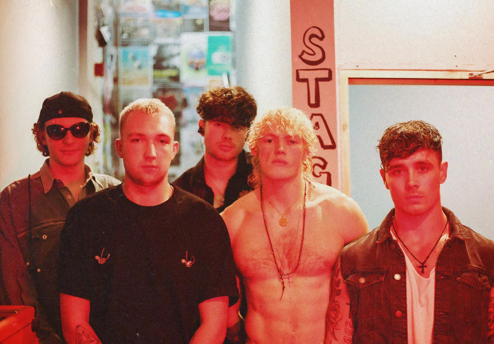
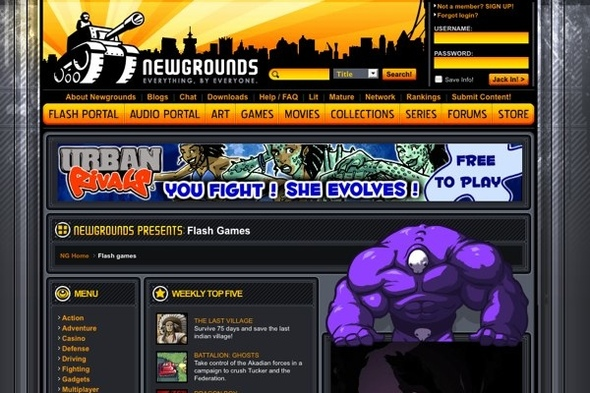
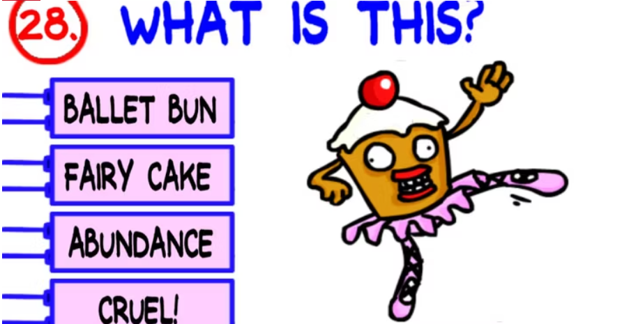
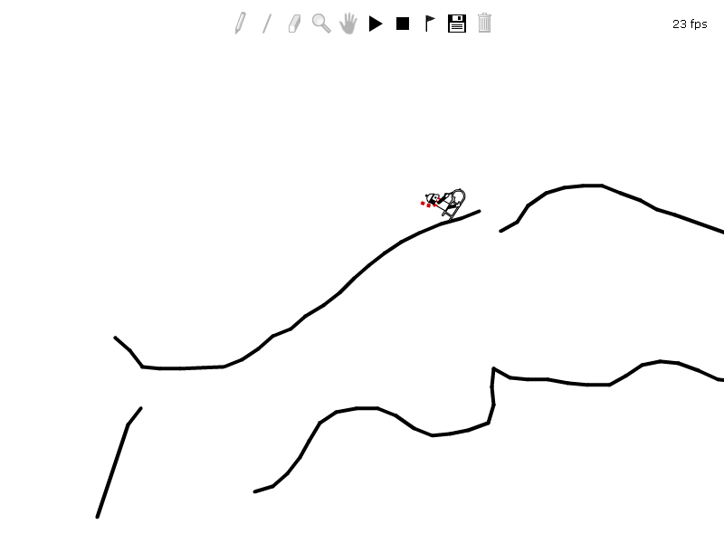
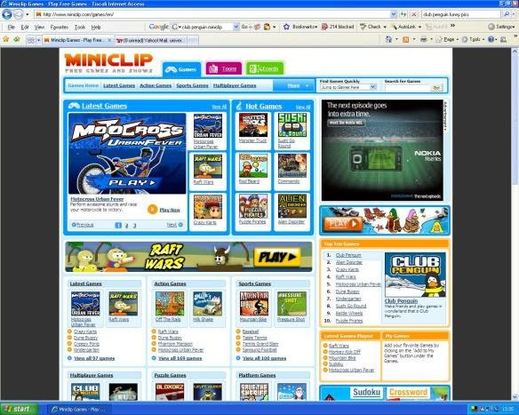
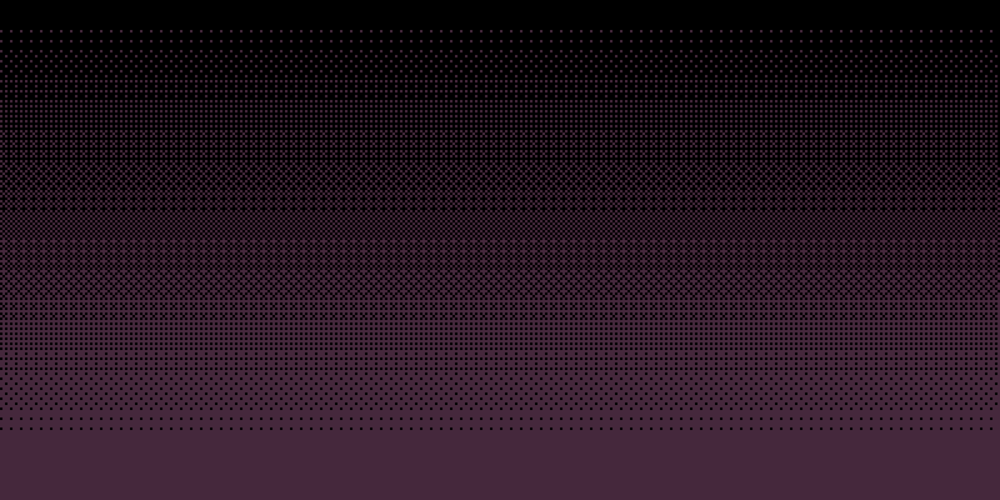
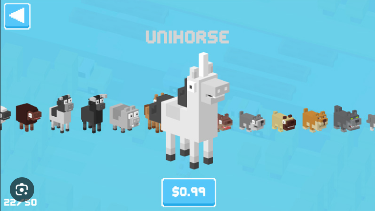
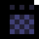

# JaVill Stage Rage

## Table of Contents

## Planning the project 

The idea for this project came from a meeting with a previous client. I have worked with this client across multiple projects, he always has fresh and out-of-the-box ideas. The client's current project is JaVill, a 5 piece band from Dublin. With loud fresh sounds and a bold colour palette, I was excited to work on anything to do with the band.

The pitch for the project was this - the client wanted some sort of interactive experience on the band website. The grapics would be simple portraits of the band members in an 8-bit art style. The player would be able to choose a band member to play as, and the game play would be extremely simple. We settled on an endless jumper game, an arcade classic and something I felt I could achieve as a novice developer. 

Some elements that were in the original plan were:
* A character selector that changes the skin of the selected character to one of the band members
* The character runs across a stage setting in front of a crowd
* The character can jump over amplifiers and can duck underneath mounted microphones
* A database for people to compare high scores over time

Not all these elements made it in to the final build, but they are being considered as future features.

## The Golden Age of Browser Games

As someone who grew up with Internet access, playing games online has always interested me. The Internet served as the perfect place for people to post home-grown simple software. During the 2000s, Adobe Flash allowed amateur developers to create their own games and post them to forums such as Newgrounds or Miniclip, along with larger MMOs offering games to their users, such as Neopets and Club Penguin.

These games are characterised by simple graphics, often rude humour and simple game play. The crude graphics give a lovingly home-made and authentic charm to to online games. Without the oversight of large corporations, these unsanitized and uncensored games gave player access to gaming experiences unlike anything being offered by big game companies at the time. This era also led to the massive success of "indie" game titles we see in pop culture today.

With the removal of browser support for Adobe Flash in 2021, many of these games became unplayable. This gives modern internet users a nostalgic feeling around these old, strange games that are no longer available to play. 

This project taps into that nostalgia with the use of hand-dran elements, pixel graphics and simple game play. However, unlike the Flash games of old, this project is not rendered obselete with the event of Flash's removal.

If you are interested, there is some further reading on this topic linked below: 
* [How Flash Games Shaped The Video Game Industry](https://www.flashgamehistory.com/#:~:text=It%20all%20started%20in%201996,automated%20Flash%20games%20website%2C%20Newgrounds.)
* [End of an Era: Flash Games](https://www.vancouverisawesome.com/events-and-entertainment/end-of-an-era-flash-games-3268327)
* [Wikipedia Entry: Browser Games](https://en.wikipedia.org/wiki/Browser_game)
* [How Flash Games Shaped Video Game History](https://www.gameinformer.com/2018/12/22/how-flash-games-changed-video-game-history)
* [What Happened to Flash?](https://www.lifewire.com/what-happened-to-flash-2617986#:~:text=What%20to%20Know,removed%20all%20Flash%2Drelated%20software.)

## The Web Page

JaVill do not currently have a website to host this browser game on. I built a simple one-page site to temporarily host this game. 

I leaned into the 2000s Internet aesthetic and kept the site very simple. After a sneak peek into JaVill's upcoming promotional photos, I chose some colours to match the theme and created a simple pixel gradient using the Bayer Matrix. Pixel gradients were first popularised in the clipart that was included in early Apple computers, and have a distinct feel to them, a mix of eccentric and Web 1.0. 

I kept the header simple, and decided to leave the plain blue hyperlink Web 1.0 aesthetic in the past. I designed a simple header with the game's title, with a childlish font that pays homage to the early days of browser based gaming. I made the text white so that it would stand out strongly against the dark background. The brush used for the title is a pixel brush on a small canvas, with the final image rendered out in 100% scale to minimise artifacting.

I added a plain black footer with some doodle-style representations of social media icons. In order to prompt the user to find the band on their socials, I also added a hand-written tag, asking the user to chack out the band's social media.

I also added a media query, so that when the screen width is small enough the footer gets bigger. The text also disappears and the social media icons are centered. This is in anticipation of making the page completely mobile friendly in the future.

## Styling the Game 

After a quick sketch on a napkin of the band members as caricatures, it was decided the game would be in an 8-bit style. This was inspired by the infinite runner/Frogger clone "Crossy Road", a game that was popular in the early days of mobile gaming. The game uses an 8-bit style in a 3D perspective.

I created some assets using a pixel art focused image editor, which I had previously used for pixel art for client work. I created a temporary character, while I wait for character design approval from the band members. 

I also created an amplifier and microphone sprite so the character has something to jump over and duck underneath.

~Background information~ 

## The Build

### HTML Canvas 

With the final half of my bachelor's degree focussed on Adobe Flash as an animation tool, I probably shouldn't have been so surprised when learning about the HTML canvas object for the first time. The possibilities with the canvas are truly infinite, and I have had a very fun time imagining the possibilities for this game. The canvas element is declared in HTML and populated using Javascript. 

### Drawing on the Canvas

The drawImage() function can take up to nine variables. It can slice the image you want to draw, and draw a slice on each frame. Once I wrapped my head around the co-ordinate system, it was easy to manipulate images using the function. 

Within Unity, the sprite slice function works the same way. I have some experience with this, and it made things a little easier to place into the function and have it render out correctly.

### Physics

I never imagined I would actually use anything from Leaving Cert physics class after I left, but for this porject it came in handy. I originally thought of the character jump as having a maximum up, and having the player fall when the velocity reaches zero. 

While looking at how to implement gravity, I came across [this tutorial](https://medium.com/codex/making-the-easiest-javascript-game-b1a0b21794b4) describing how to build a game very similar to the one I wanted to make. While disheartened, I decided not to read the whole tutorial, as I was having fun figuring out the canvas functions from existing documentation.

### Obstacles

Rather than creating a new obstacle each time and destroying it once it leaves the canvas, the obstacles encountered by the players are simply drawn once and moved out of frame, then reset their x-position off-canvas to the right. This means the obstacles we see are actually the same two obstacles over and over again. 

I wanted the mic to spawn in at one-fifth the rate of the amp. I increased the random interval range that the mic is able to spawn in by 5. This means that, over a long enough time, the amp will spawn in at one-fifth the rate of the amp, as if has a chance of spawning five times further away. 

There is an issue with this spawning method. There is a chance that a mic and amp will spawn too close together, meaning the player will have to duck and jump at the same time. In the future, I could deal with this by drawing a larger collision box around the amp. On spawning, the mic object runs a check to see if it is within this larger collision box and if so, resets it's x position. This would prevent the objects from spawning too close together. For now, the player can deal with this "impossible" gameplay issue by cheating, as described below.

### Cheating 

Instead of recalculating the mic as two collision boxes, one the whole size of the mic and one off the ground that the player must crouch under, I used a trick. 

The player always collides with the mic, but as long as they are in the "crouch" position (the down arrow is pressed) the game will not end. 

This allows some cheating, however. If the player jumps over the mic, as long as the down button is held, the game will not end. 

For now, I have kept this in to deal with the mic and amp spawning together issue. 

======= The plan =======

Jonathan needs a game for his website. Will collect deatails over the weekend

* A classic infinite run n jumper
* Character selector - select from pixel art of the four band mates
* They get bigger when selected
* The character runs a stage
* Jump to clear amps, crouch to clear mics on a stand
* Database for high scores 

==== Building the Project ======

--- Building log ---
First step - building the page. Went to W3 schools to freshen up on HTML basics. 
Built out the meta details in the header
Added twitter card for the band to share their game 
Plan for game, based on previous Unity build, div for game window, character div, obstacles are divs too 
It was at this point I found a site telling me how to build the game I wanted :( I'll have to build on what it says [https://medium.com/codex/making-the-easiest-javascript-game-b1a0b21794b4]
I have decided not to read the whole tutorial. For now.

Took a new route, drawing elements of the game using JS [https://www.w3schools.com/graphics/tryit.asp?filename=trygame_default_gravity]
JS has a gravity function? Great news
JS character movement uses some of the same principles of c# character movement that I have already learned ( += )

Drawing the canvas: 
When using HTML like this, the drawn box is referred to as the "canvas", the same as when using Adobe Flash in college. The canvas also uses something called "context" [https://developer.mozilla.org/en-US/docs/Web/API/CanvasRenderingContext2D] denoted as ctx in the JS file.
The context can be set to 2D to allow the program to draw on the canvas. [https://developer.mozilla.org/en-US/docs/Web/API/HTMLCanvasElement/getContext]. This can be useed to set an alpha value, for example adding a background of crowd paralax in the future. The desynchronized method decouples the drawing of the canvas from the event loop, so a background could change at a dufferent rate than a character for example.
I want my game to be full screen and responsive. When drawing the canvas at game start, I am unsing the innerWidth/innerHeight methods

Sprite not drawing, getting this error:Uncaught TypeError: Cannot read properties of undefined (reading 'drawImage')
    at window.onload (script.js:12:13)

Clearing the board: 
As I intend for the obstacles to be somewhat randomly generated, the clear method clears everything within the borders of the canvas using clearRect ]

Started new project 

Started again from scratch. Drawing the image [https://spicyyoghurt.com/tutorials/html5-javascript-game-development/images-and-sprite-animations][https://spicyyoghurt.com/tutorials/html5-javascript-game-development/setup-html5-canvas-game] 

Note for sprite animation: JS can silce and play sprites like Unity : [https://spicyyoghurt.com/tutorials/html5-javascript-game-development/images-and-sprite-animations]

The canvas is alway drawn from the upper left corner, and the positional co ords are relative to this. +x +y only

Project got easier after initial reading on canvases, as adding player controlis largely the same as unsing the c# unity intergraitions, whoch I leanred before for a pixel art job for a client 

Relied heavily on the Web3 schools documentation on JS games to learn about canvas + component building [https://www.w3schools.com/graphics/game_controllers.asp] this isn't the right link

Keydown events from Unity [https://docs.unity3d.com/ScriptReference/KeyCode.DownArrow.html][https://www.tutorialspoint.com/detecting-arrow-key-presses-in-javascript#:~:text=onkeydown%20JavaScript%20event%20handler%20by%20passing%20arrow%20key%20unique%20codes.&text=When%20the%20script%20executed%2C%20it,an%20alert%20%E2%80%9Cdown%20key%E2%80%9D.][https://www.w3schools.com/jsref/event_onkeypress.asp``]

Web3Schools recommends .keyCode method, but this is deprecated. The more suitable method is .key 

Right baout here is where the documentation for the type of jump I want in my game isn't inthe documentation, so I have to experiment

Looked into managing bitmap scaling re responsivness, added constant w/h 

[https://www.javascripttutorial.net/javascript-dom/javascript-keyboard-events/]

[https://www.w3schools.com/jsref/canvas_drawimage.asp#:~:text=The%20drawImage()%20method%20draws,increase%2Freduce%20the%20image%20size.]
#
# To do List 
## Good
* "How to Play" div
* Use scaleRatio to make things scalable

## Better
* Parallax BG
* Some osrt of time flooring/delta time (24fps)
## Best
* Add tab icon in HTML header
* Add more social media cards to header
* Add touch screen control [https://www.w3schools.com/graphics/game_controllers.asp]

Sources:
[https://developer.mozilla.org/en-US/docs/Web/API/EventTarget/addEventListener]
[https://www.w3schools.com/howto/howto_js_animate.asp#:~:text=JavaScript%20animations%20are%20done%20by,small%2C%20the%20animation%20looks%20continuous.]
[https://developer.mozilla.org/en-US/docs/Web/API/Web_components]
[https://developer.mozilla.org/en-US/docs/Web/API/Document/createElement]
[https://www.w3schools.com/graphics/game_components.asp]
[https://www.cozyroc.com/ssis/javascript-parameters#:~:text=JavaScript%20Task%20and%20JavaScript%20Component,of%20the%20task%2Fcomponent%20editor.]

Game interval  : [https://codeincomplete.com/articles/javascript-game-foundations-the-game-loop/] 

Player's x and y co-ords are declared with "let" instead of "const" as I haven't made my mindup about the amount the player will be able to move him yet 

Player and line are no longer drawn on canvas. For player I suspect the file is too big to load between frames. Possible fix: vector graphic. For line no idea why it disappeared

Trying switch cases instead of if else because need multiple button controls 

Collision is working BUT collision box is from top of player's head 

Approaching physics like in previous games. JS does not have inbuilt gravity/velocity like I thought.

Passing the player jump function into the up arrow case [https://cmorinan.medium.com/passing-functions-as-arguments-in-javascript-tips-and-pitfalls-d29bbd4522a9]

Using basic physics to add in velocity -- might be a weird way to calculate. Similar principles to "ease" in animation, get exponential change over time. Therefore, speed*acceleration = velcity 

Change out the switch cases for separate functions, as I'm not sure about switch cases and functions

For speedX/speedY [https://developer.mozilla.org/en-US/docs/Web/API/KeyboardEvent/code]

Note for tomorrow = start on speed 

[https://developer.ibm.com/tutorials/wa-build2dphysicsengine/] <== for physics equations>

Delta time as used in C# projects

JUMP WORKS!!!!

Player lands under floor [https://developer.mozilla.org/en-US/docs/Games/Tutorials/2D_Breakout_game_pure_JavaScript/Collision_detection]

Prevent player from double jump 

Fixed. Player position set to on ground on completeion of jump

JS file is getting messy. Make new class file for obstacles [https://bobbyhadz.com/blog/javascript-import-class-from-another-file][https://www.w3schools.com/js/js_classes.asp][https://developer.mozilla.org/en-US/docs/Web/JavaScript/Guide/Using_classes]

obstacles need to be random, move twd player on x axis and drawn from file [https://www.w3schools.com/graphics/game_obstacles.asp]

Can generate obstables in canvas using push method maybe

Rejig keyboard controls [https://developer.mozilla.org/en-US/docs/Games/Techniques/Control_mechanisms/Desktop_with_mouse_and_keyboard]

Obstacle collision handling attempt 1 [https://blog.thejaytray.com/canvas-basics-06-collision-detection/]

Objects collide when the distance between them = 0; 
Could check if dis = 0 within a function 

 

if (distanceBetweenObjects === 0) {
    gameOver();
}

function distanceBetweenObjects(player, object) {
    if (playerArea is inside objArea) {
        return 0;
    }
}

Move co ords into variables so they can be referenced 

Generating a random interval 450-550 [https://www.educative.io/answers/how-to-generate-a-random-number-between-a-range-in-javascript]

I want roughly 1 mic for every 5 amps, so the random range should be 5x the amp range to average out the numberss

Instead of calculating custom bounding box, for mic collision check : 
        if ( mic collision true + down button held){
            continue game
        } else if {
            (mic collision true + !down button held){
                end game 
            }
        }

Change keyboard controls. Had it so that all keys made him jump [https://www.w3schools.com/graphics/game_controllers.asp]

Time to add game over condition + text [https://developer.mozilla.org/en-US/docs/Web/API/Canvas_API/Tutorial/Drawing_text]
On game over * Game speed = 0 
            * Game over printed to canvas 
            * Promt player tp play again 

To reset game, programme should 
        * Reset variables 
        * Remove UI related to game over

Bug : Player can cheat while holding down arrow 

Animation ttimme [ https://spicyyoghurt.com/tutorials/html5-javascript-game-development/images-and-sprite-animations]

Building web page 
*Take inspritation from early internet culture - miniclip, newgrounds

Add a score keeper [https://developer.mozilla.org/en-US/docs/Games/Tutorials/2D_Breakout_game_pure_JavaScript/Track_the_score_and_win]

Add high score but it's broken (only shows 1st score)

Use animation tutorials : [https://www.youtube.com/watch?v=CY0HE277IBM&list=PLYElE_rzEw_uryBrrzu2E626MY4zoXvx2&ab_channel=Frankslaboratory] and [https://spicyyoghurt.com/tutorials/html5-javascript-game-development/images-and-sprite-animations]

Writing the readme support [https://github.blog/changelog/2021-04-13-table-of-contents-support-in-markdown-files/]
[https://docs.readme.com/main/docs/linking-to-pages#:~:text=To%20link%20inline%2C%20type%20the,%2C%20%22(y)%22.&text=Reference%2Dstyle%20linking%20allows%20you,refer%20to%20it%20multiple%20times.]

Also talk about 

Aseprite 
How I had to resart the project 
